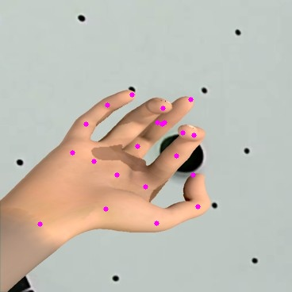
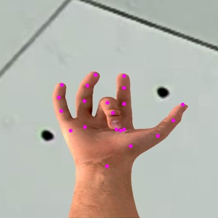

# OpenPose MobileNet Pytorch
Implementation of OpenPose MobileNet architecture using PyTorch. :sunglasses: :sunglasses: <br>
This implementation is inspired from the paper "Real-time 2D Multi-Person Pose Estimation on CPU:
Lightweight OpenPose". <br>
I have used "Hands from Synthetic Data" published by CMU which has 21 keypoints for every hand image. <br>
I have removed the paf maps from the architecture and have just trained the model on keypoint maps. I will try to add it in the subsequent commits :wink:. <br>
If you would like to contribute, please feel free to do so. <br>

## Requirements
* torch>=1.2.0 <br>
* torchvision>=0.3.0 <br>
* opencv>=4.2.0 <br>

## Steps to run
1. Download the "Hands from Synthetic Data" from [this link](http://domedb.perception.cs.cmu.edu/panopticDB/hands/hand_labels_synth.zip) and keep the folder "hand_labels_synth" in the main directory. Final directory structure below :point_down: :point_down:<br>
```
$(ROOT)
  |__ hand_labels_synth
            |__synth1
                 |__ 000000.jpg
                 |__ 000000.json
                        ...
            |__synth2
                 |__ 000000.jpg
                 |__ 000000.json
                        ...
            |__synth3
                 |__ 000000.jpg
                 |__ 000000.json
                        ...
            |__synth4
                 |__ 000000.jpg
                 |__ 000000.json
                        ...
   |__ _checkpoints
            |__ checkpoint_best.pth
   |__ val.py
   |__ train.py
   ...
```
2. (Optional :grinning:) Edit the filenames in config.py files according to your requirement. Download the checkpoint file from [here] (https://drive.google.com/file/d/1vSGPJp3sj22GCQZeOLb7Ynzgo3gHlus4/view?usp=sharing), place it in "\_checkpoints" folder and edit the checkpoint_path file in config.py accordingly. :thumbsup:<br>
3. To prepared the dataset for training, run: <br>
```.bash
python scripts/prepare_train_labels.py
```
This create a pickle file named "synth2-synth3" (according to my config.py file :innocent:) which can be used for training. <br>
4. To start the training process, run:
```.bash
python train.py
```
This will train the model and after every 1000 iterations, uses one image to predict the hand points using the trained network. <br>
5. To validate on an entire folder of images, <b> edit the checkpoint_path variable in config.py to point the required checkpoint file</b>,run:
```.bash
python val.py
```
This predicts hand points for all the images in the folder and stores the result in "outputs" folder (again, according to my config.py!! :satisfied:). <br> <br>
## Results
 <br>
 <br>
<b> <i> Number of Stages: 2 ; Batch Size: 8 </i> </b> <br>

## Final Note
The outputs are fairly accurate, but there are a couple of keypoints which are slightly off place. Guess it needs more training. :grin: <br> <br>

Go ahead..pull it, train it and have fun. :smile:

-------------------------------------
<p align="center">
:star: Happiness should be a function without any parameters :star: <br> <br>
<b>Happy Coding</b> :exclamation: :exclamation:
</p>
